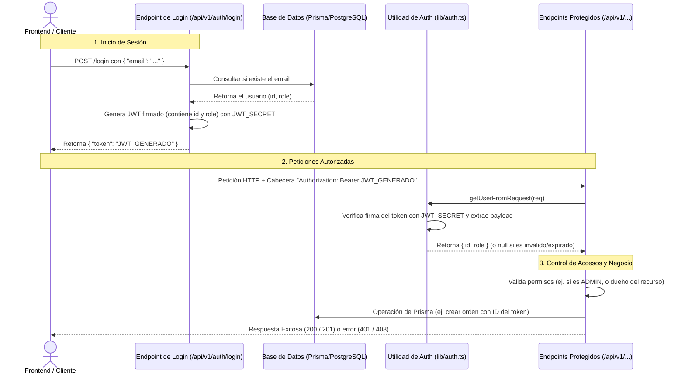

# Distribución de Tareas: Migración de Seguridad a JWT

Este documento detalla la planificación y distribución de tareas para sustituir por completo el sistema de tokens quemados ("hardcodeados") por un sistema dinámico y seguro de JSON Web Tokens (JWT) utilizando la librería `jose`.

---

## 🔒 Arquitectura del Nuevo Sistema de Seguridad

Para entender cómo cambiará la seguridad por completo, este es el flujo de peticiones que tendrá la aplicación:

### Conceptos Clave:
* **Login con Contraseña:** La autenticación se realizará validando tanto el correo electrónico como la contraseña proporcionada por el usuario, la cual se comparará (mediante `bcryptjs`) contra el hash seguro guardado en el nuevo campo `password` del modelo `User` en `schema.prisma`.
* **Sesión sin Estado (Stateless):** El servidor no guarda las sesiones. Toda la información de identidad del usuario (`id` y `role`) viaja de forma segura dentro del JWT firmado.
* **Control de Accesos:** Cada endpoint protegido usará el helper para extraer la identidad y tomar decisiones (ej. verificar si es administrador para mutar productos, o verificar que una orden sea del usuario que la solicita).

---

## 👤 PARTE 1: Infraestructura de Auth, Login y Perfil (Desarrollador A)

Este desarrollador se encarga de sentar las bases criptográficas, la creación del token y el inicio de sesión del usuario.

### Tareas Pendientes:
1. **Instalación y Variables de Entorno:**
   - Ejecutar `npm install jose bcryptjs` y `npm install -D @types/bcryptjs`.
   - Definir la variable `JWT_SECRET` en el archivo `.env` en la raíz (ej. `JWT_SECRET=un_secreto_muy_seguro_de_32_caracteres`).
2. **Helper de Autenticación (`lib/auth.ts`):**
   - Implementar la función `getUserFromRequest(req: NextRequest)` que:
     - Lea la cabecera `Authorization`.
     - Extraiga el token quitando la palabra "Bearer ".
     - Verifique la firma con `jose.jwtVerify()` usando el `JWT_SECRET` del `.env`.
     - Retorne `{ id, role }` si el token es válido o `null` si ha expirado/es inválido (usando `try/catch`).
3. **Creación del Endpoint de Login (`app/api/v1/auth/login/route.ts`):**
   - Crear una ruta POST que acepte un body con `{ email, password }`.
   - Verificar si el usuario existe usando `prisma.user.findUnique({ where: { email } })`.
   - Si no existe, responder con error `401` (`AUTH_TOKEN_MISSING_OR_INVALID`).
   - Si existe, validar la contraseña cifrada usando `bcrypt.compare(password, user.password)`. Si es incorrecta, retornar `401`.
   - Si la contraseña es válida, firmar un token mediante `jose.SignJWT` incluyendo el `id` y `role` del usuario.
   - Retornar `{ token }` al cliente.
4. **Protección del Perfil Propio (`app/api/v1/users/me/route.ts`):**
   - Reemplazar la lógica de tokens quemados por la llamada a `getUserFromRequest(request)`.
   - Obtener el usuario de Prisma usando el `id` del token verificado y responder con sus datos reales.

---

## 👤 PARTE 2: Protección y Reglas de Negocio en Endpoints (Desarrollador B)

Este desarrollador se encarga de limpiar el código hardcodeado existente en las rutas de negocio y aplicar las políticas de acceso dinámicas.

### Tareas Pendientes:
1. **Protección de Creación de Productos (`app/api/v1/products/route.ts`):**
   - Reemplazar la validación `token !== 'admin-token'` por el helper `getUserFromRequest(request)`.
   - Retornar `401` si no hay token o es inválido.
   - En el método `POST`, validar que el rol del usuario recuperado sea estrictamente `'ADMIN'`. Si no lo es, retornar error `403` (`INSUFFICIENT_PERMISSIONS`).
2. **Asociación Dinámica de Órdenes (`app/api/v1/orders/route.ts`):**
   - En la petición `POST`, extraer el usuario desde el token real usando `getUserFromRequest`.
   - Eliminar `body.customerId` de la lectura del payload (evita que un cliente cree órdenes a nombre de otro).
   - Crear la orden en Prisma usando el ID extraído del token del cliente (`customerId: user.id`).
3. **Seguridad en Órdenes Individuales (`app/api/v1/orders/[id]/route.ts`):**
   - Obtener la orden de la base de datos con Prisma.
   - Extraer el usuario autenticado desde el token.
   - Permitir la lectura del endpoint `GET` únicamente si el usuario autenticado es el dueño de la orden (`user.id === order.customerId`) O si su rol es `'ADMIN'`. En cualquier otro caso, retornar `403` (`INSUFFICIENT_PERMISSIONS`).
4. **Control de Cambio de Estado (`app/api/v1/orders/[id]/status/route.ts`):**
   - En la petición `PATCH`, validar que el usuario autenticado tenga el rol `'ADMIN'`. Si no es así, retornar `403` (`INSUFFICIENT_PERMISSIONS`).

---

## 🚦 Estrategia de Trabajo sin Código Hardcodeado ni Mocks

Para cumplir estrictamente con la regla de **cero código hardcodeado**, no utilizaremos ningún "mock" o simulación temporal en el repositorio. En su lugar, el flujo de integración será el siguiente:

1. **Fase 1: Creación del Helper Real (Desarrollador A)**
   - El **Desarrollador A** instala `jose` y crea la implementación real y completa del helper en `lib/auth.ts` (verificando firmas JWT reales utilizando la clave del archivo `.env`).
   - Sube este cambio a la rama compartida o realiza un Pull Request (PR) inicial para integrarlo a la rama principal (`main` o `develop`).
2. **Fase 2: Consumo e Integración (Desarrollador B)**
   - Una vez integrado el helper real en la rama principal, el **Desarrollador B** actualiza su repositorio local (`git pull`).
   - A partir de este momento, utiliza el helper real `getUserFromRequest` para proteger las rutas del negocio (Productos y Órdenes).
3. **Desarrollo en paralelo (Opcional):**
   - Si necesitan avanzar al mismo tiempo sin esperar a Git, el **Desarrollador A** simplemente puede compartir el archivo `lib/auth.ts` terminado directamente por mensaje al **Desarrollador B** para que este lo coloque en su carpeta `lib/` local. De esta forma, ambos trabajan sobre la lógica final sin subir código temporal al repositorio de Git.
